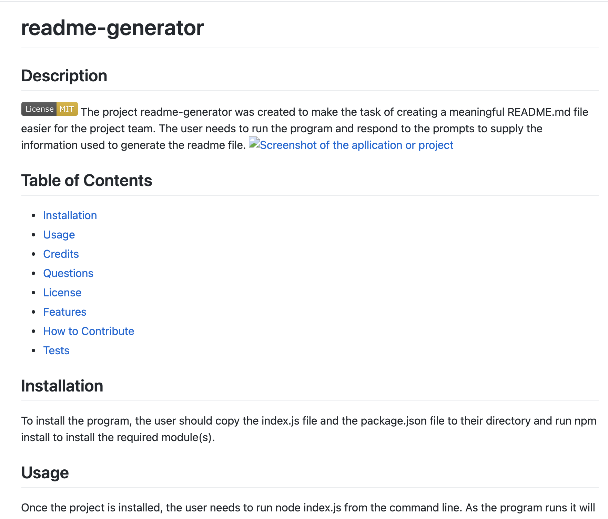

# readme-generator
## Description
This project is designed to make it easier for users to create a README.md file for their project.  It contains prompts to help remind the user what features make for a good readme file.

## Table of Contents (Optional)
If your README is long, add a table of contents to make it easy for users to find what they need.
- [Installation](#installation)
- [Usage](#usage)
- [Credits](#credits)
- [Questions](#questions)
- [License](#license)
- [Features](#features)
- [How to Contribute](#how to contribute)
- [Tests](#tests)
## Installation
To install the project you just need to copy the files over to your working directory
## Usage
A user can ru the program by entering the command node index.js on the command line.
## Credits
This project uses the inquirer module
## Questions
If you have any questions you can contact me through my github user profile: https://github.com/bdstpierre

or by emailing me at barry@stpierre.com
## License
MIT license
## Features
undefined
## How to Contribute
undefined
## Tests
undefined
